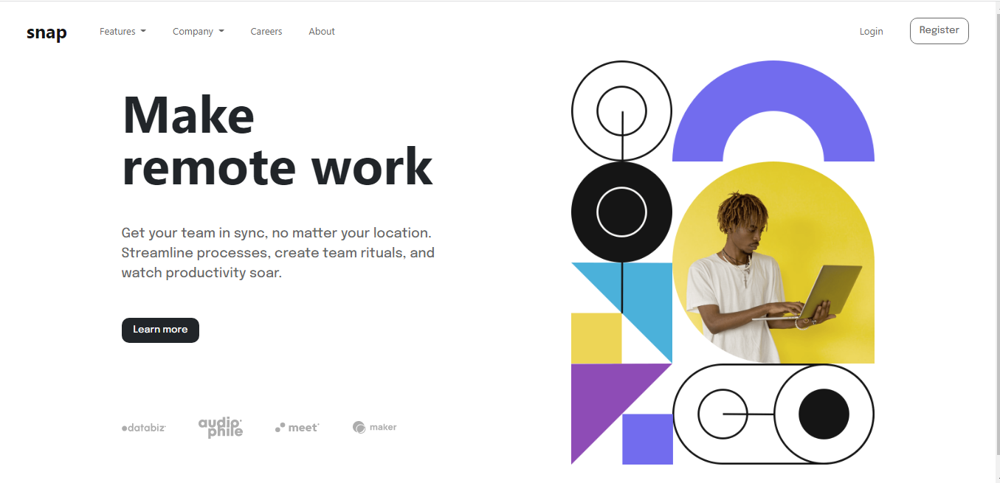

# Frontend Mentor - Intro section with dropdown navigation solution

This is a solution to the [Intro section with dropdown navigation challenge on Frontend Mentor](https://www.frontendmentor.io/challenges/intro-section-with-dropdown-navigation-ryaPetHE5). Frontend Mentor challenges help you improve your coding skills by building realistic projects. 

## Table of contents

- [Overview](#overview)
  - [The challenge](#the-challenge)
  - [Screenshot](#screenshot)
  - [Links](#links)
- [My process](#my-process)
  - [Built with](#built-with)
  - [What I learned](#what-i-learned)
  - [Continued development](#continued-development)

## Overview

### The challenge

Users should be able to:

- View the relevant dropdown menus on desktop and mobile when interacting with the navigation links
- View the optimal layout for the content depending on their device's screen size
- See hover states for all interactive elements on the page

### Screenshot

### Links

- Live Site URL: [https://rubbydoc.github.io/intro-section-with-dropdown-navigation/]()

## My process

### Built with

- Semantic HTML5 markup
- [Bootstrap](https://getbootstrap.com/) - CSS Framework

### What I learned

I learned to try the different functionalities of bootstrap grid system. By doing this project, I was able to analyze their usage while applying it on my code at the same time.

### Continued development

Use this section to outline areas that you want to continue focusing on in future projects. These could be concepts you're still not completely comfortable with or techniques you found useful that you want to refine and perfect.

There are many things that I want to improve after I have finished this project. First is I want to gain more knowledge on how I am going to make a web application more responsive and resize depending on the device. And lastly I want to improve my skills on positioning elements.

